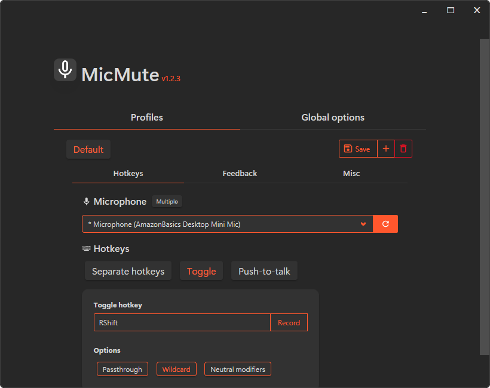
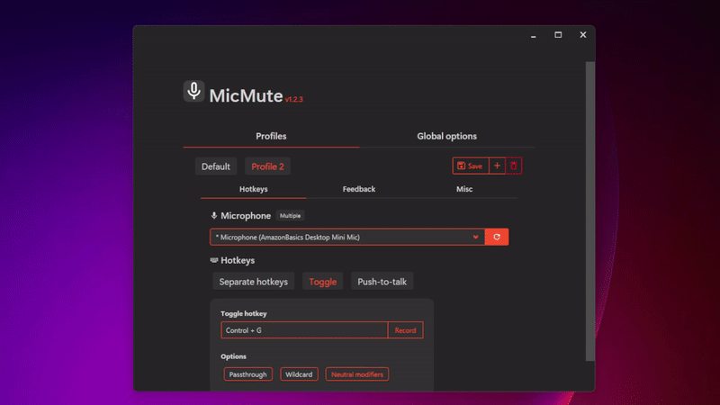
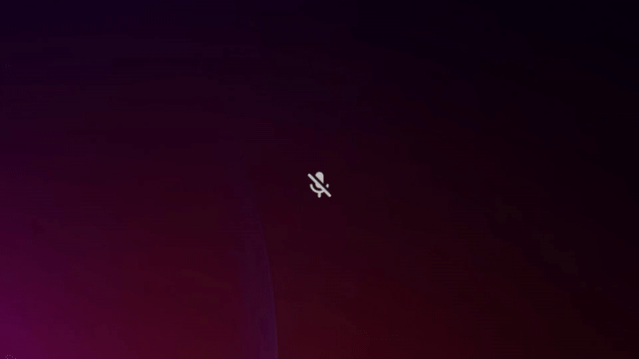
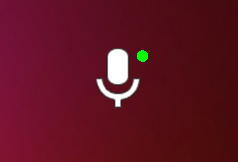
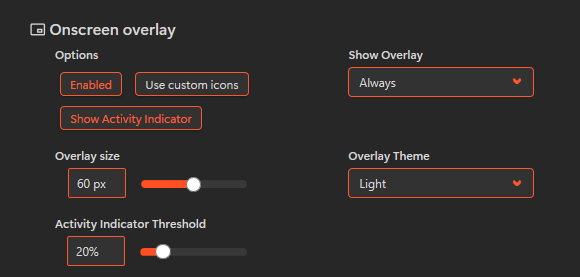
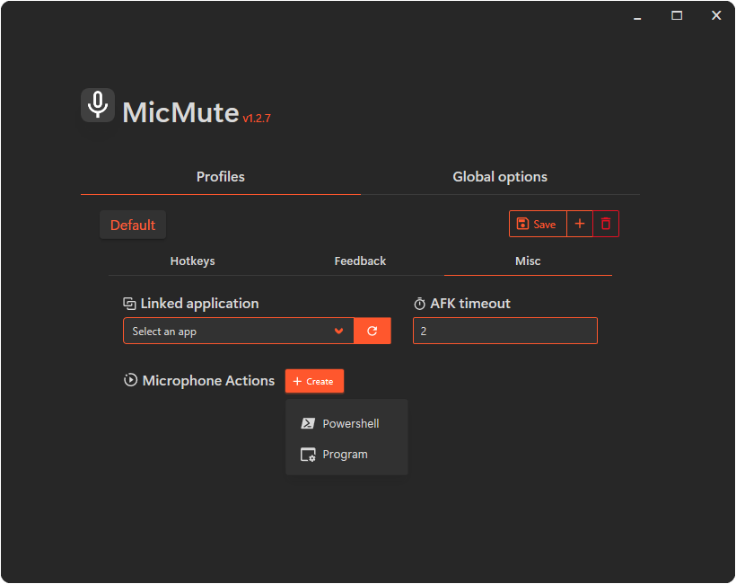
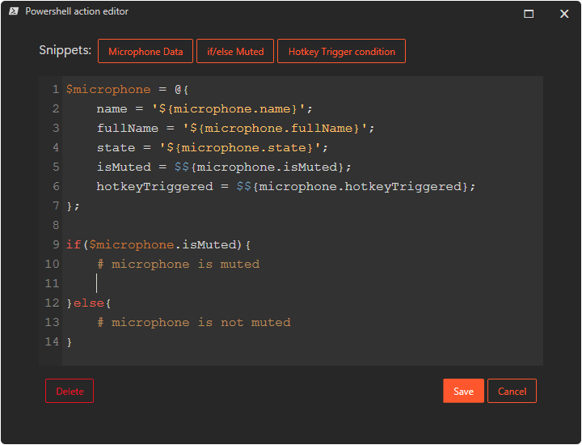
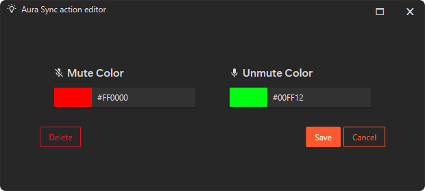
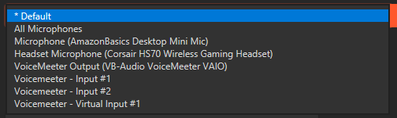

<h1 align="center">
    </img>
    MicMute
</h1>
<p align="center">
    Super simple mic control with all the tweaks you could ever want.
</p>

<p align="center">
    <a href="https://github.com/SaifAqqad/AHK_MicMute/releases/latest"></a>
    <a href="https://github.com/SaifAqqad/AHK_MicMute/releases/latest"></img></a>
    <a href="https://github.com/SaifAqqad/AHK_MicMute/actions?query=workflow%3Acompile_prerelease"></img></a>
</p>

## Features

   * Set up multiple profiles and link them to apps/games
   * Control multiple microphones simultaneously 
   * Use separate hotkeys for Mute/Unmute or a single toggle/push-to-talk/push-to-mute hotkey
   * AFK timeout - Automatically mutes the microphone when you're AFK
   * Customizable sound and on-screen feedback
   * Always-on-top overlay to show the microphone's state
   * Run custom scripts/programs when muting/unmuting the microphone
   * ASUS Aura Sync integration
   * Voicemeeter integration

## Installation
### A. Install using [Scoop](https://scoop.sh)

```powershell
# Add the extras bucket
scoop bucket add extras

# Install MicMute
scoop install micmute
```

   <small> You can update MicMute using `scoop update micmute`, your config file will be saved between updates.</small>

### B. Use standalone executable
   You can download [MicMute](https://github.com/SaifAqqad/AHK_MicMute/releases/latest/download/MicMute.exe) and use it standalone.
###### Note: The config file will be saved in the same directory as the executable.

## Usage
      
<small>The first time you launch MicMute, a configuration window will open</small>

1. Select your microphone from the list.
2. Choose the hotkey type (Toggle, Push-to-talk or seperate hotkeys).
3. Select the hotkey options you want. see [hotkey options](#hotkey-options).
4. Click Record and press the key(s) combination for the hotkey, then click on Stop to save it.
5. Go to the `Feedback` tab and select the feedback options you want. see [feedback options](#feedback-options).
6. If you're setting up multiple profiles, you can link a profile to an app/game. see [linked applications](#linked-applications).
7. If you want the microphone to be auto muted when you idle, setup `AFK timeout`.
8. If you're setting up a PTT hotkey, you can change the delay between releasing the key and the audio cutting off by changing the `PTT delay` option.
9. Click on the save button.

### Notes
* You can change a profile's name by right clicking it.
  <details>
  <summary>GIF</summary>

  
  </details>
* When you set up a hotkey for a microphone, a `*` will appear before the microphone's name
<hr>

### Hotkey options
|      Option       | Description                                                                                                                                                      |
| :---------------: | ---------------------------------------------------------------------------------------------------------------------------------------------------------------- |
|    Passthrough    | Hotkey presses will passthrough to the system (They won't be exclusive to MicMute).                                                                              |
|     Wildcard      | Trigger the hotkey even if it's pressed with extra modifiers/keys.                                                                                               |
| Neutral modifiers | MicMute won't differentiate between Left and Right modifiers (i.e Left/Right shift will both be Shift). This option should be set *before* recording the hotkey. |
|    Hybrid PTT     | Turns a PTT hotkey into a Hybrid PTT/Toggle hotkey (Long press -> PTT, short press -> toggle).                                                                   |
<hr>

### Feedback options
#### 1. Sound feedback
Play a sound when muting/unmuting the microphones.
* You can select which output device to play the sound on.

* You can use custom sounds:
   1. Turn on the option in the config UI
   2. Make sure the sound files (`mp3`,`wav`) are in the same folder as `MicMute.exe`
   3. Rename them as:
        * **Mute sound**: `mute` 

        * **Unmute sound**: `unmute` 

        * **PTT on**: `ptt_on` 

        * **PTT off**: `ptt_off`


#### 2. On-screen feedback
Show an OSD when muting/unmuting the microphones. 

* <details>
  <summary>GIF</summary>

  
  </details>
* You can change the OSD position (default position is the bottom center of the screen, above the taskbar).
* You can exclude fullscreen apps/games from the OSD, this is needed for some games that lose focus when the OSD is shown.

#### 3. On-screen overlay
Show the microphone's state in an always-on-top overlay.

*  <details>
    <summary>GIF</summary>

    
   </details>
* <kbd>CTRL</kbd> <kbd>ALT</kbd> <kbd>F9</kbd> toggles show/hide
* <kbd>CTRL</kbd> <kbd>ALT</kbd> <kbd>F10</kbd> toggles locked/unlocked 
* You can drag the overlay to change its position when it's unlocked
* Games need to be set to `Windowed fullscreen` or `Borderless` for the overlay to show up on top
* You can set the overlay to only show if the microphone is muted or unmuted
* You can set the overlay's size and theme (light/dark)
* You can use custom icons for the overlay. 
    To use this feature, turn on the option in the config UI, then place the icons (`ico`/`png`/`jpeg`) in the same folder as `MicMute.exe` and rename them as:  
    -  Mute icon: `overlay_mute`
    -  Unmute icon: `overlay_unmute`
* The voice activity indicator <small>`v1.3.3+`</small> can be enabled to show when audio is detected through the microphone
    <details>
    <summary>Screenshot</summary>

    
    
    Configuration:            
    
   </details>

<hr>

### Linked applications
Link a profile to an app/game, when the app becomes visible (not minimized or hidden), MicMute will automatically switch to that profile, when the app is minimized/hidden/closed, MicMute will switch back to the default profile.

**Foreground only** option (Enabled by default) can be disabled so background apps (minimized or hidden) can also trigger the profile switch. <small>`v1.2.8+`</small> 

### Volume Lock
Locks the microphone's volume to a specific value and prevents other apps from changing it.
<small>`v1.2.8+`</small>

### Microphone actions
Run programs and powershell scripts when muting/unmuting the microphone(s).
<details>
 <summary>Screenshot</summary>

 
</details>

#### 1. Program action:
 Run any program (with optional arguments) when muting/unmuting the microphone(s).

 You can also use the following variables in the arguments, which will be replaced with the actual values for the microphone:

  |            Variable             | Description                                                                                                                                                                                                                 |
  | :-----------------------------: | --------------------------------------------------------------------------------------------------------------------------------------------------------------------------------------------------------------------------- |
  |      `${microphone.name}`       | The microphone's name (example: `Headset Microphone`). <br> When using **All Microphones**, this will only contain the word `Microphones`                                                                                   |
  |    `${microphone.fullName}`     | The microphone's full name, including the controller's name (example: `Headset Microphone (Razer Barracuda X)`). <br> When using **All Microphones**, this will contain the full name of every microphone seperated by `, ` |
  |      `${microphone.state}`      | The current state of the microphone (`Muted` or `Online`)                                                                                                                                                                   |
  |     `${microphone.isMuted}`     | Whether the microphone is muted or not (`true` or `false`)                                                                                                                                                                  |
  | `${microphone.hotkeyTriggered}` | Whether the hotkey was triggered or not (`true` or `false`). <br> if this is `false`, the microphone was muted/umuted externally (by windows or another app)                                                                |

#### 2. Powershell action:
Run a powershell script when muting/unmuting the microphone(s), This can be used for ***anything***, for example, you could send an http request to turn on/off a connected light with [Home Assistant](https://developers.home-assistant.io/docs/api/rest/#actions) or send a notification to your phone with [ntfy](https://docs.ntfy.sh/).

You can use the same variables as the program action (and you can insert the '**Microphone Data**' snippet in the editor to use them).
*  <details>
    <summary>Screenshot</summary>

    
   </details>

*  <details>
    <summary>HTTP request example</summary>
    <br>

    This example sends a notification using [ntfy](https://ntfy.sh/).
    ```powershell
   $microphone = @{
       name = '${microphone.name}';
       state = '${microphone.state}';
   };

   $ntfyUrl = "https://ntfy.sh";
   $ntfyBody = @{
      topic = 'your topic here';
      message = "$($microphone.name) $($microphone.state)";
      title = 'MicMute Alert';
      priority = 4;
   } | ConvertTo-Json;

   Invoke-RestMethod -Method Post -Uri $ntfyUrl -Body $ntfyBody -ContentType 'application/json';
    ```
   </details>

<small>This action works by encoding the script using base64 (UTF-16LE) and then passing it to powershell using the `-EncodedCommand` parameter, this avoids the need to create a temp file to run the script and even avoids any issues related to escaping special characters.</small>

#### 3. Aura Sync action: <small>`v1.2.8+`</small>
Syncs the microphone's state with ASUS Aura Sync compatible devices.

* You need to have **Armoury Crate** (or the standalone Aura Sync app) installed for this action to work, though it doesn't need to be running.
*  <details>
    <summary>Screenshot</summary>

    
   </details>

<small>Due to how slow the Aura Sync API is, this action requires a seperate MicMute process that controls the RGB by listening for messages from the main MicMute process, this ensures that the action does not affect the responsiveness of the hotkeys.</small>

<hr>

### Global options
These options are shared between all profiles.
#### 1. Mute on startup
Mute the microphone(s) when starting up or switching profiles.
#### 2. Switching-profile OSD
Show an OSD with the profile's name when switching to it.
#### 3. UI Theme
UI Theme can be set to `System Theme`, `Dark` or `Light`

<small>This does *not* affect the tray icon color, which is always based on the system theme</small>

#### 4. Force microphone state
Prevent other apps from changing the microphone's state (i.e mute/unmute the microphone).
##### Note: This might break the unmute functionality in some apps, if this happens you'll need to unmute the microphone using MicMute before unmuting inside the app)

#### 5. Voicemeeter integration
You can control Voicemeeter's inputs and outputs using MicMute, after turning on the option, refresh the microphones list and you should see voicemeeter's inputs (strips) and outputs (buses) in the microphone dropdown.
* <details>
  <summary>Screenshot</summary>

  
</details>

By default, MicMute will use the bus/strip's `mute` property, in the case of a strip, it can be set to any other property (`A1`, `A3`, `B3`, etc..) by changing the `VMRStripProperty` value in the [config file](#editing-the-config-file).

<hr>

### Controlling multiple microphones
You can have multiple active hotkeys to control different microphones simultaneously.
To do this, turn on the `Multiple` option then select another microphone from the list and setup hotkeys for it.

When using this feature, the following applies:

* The tray icon will be the static MicMute icon
* The tray icon will no longer act as a toggle button, and the tray menu option to toggle the microphone will be disabled
* The [On-screen feedback](#2-on-screen-feedback) OSD will show the microphone name when muting/unmuting
* The [On-screen overlay](#3-on-screen-overlay) is disabled

#### Alternatively, you can control all the microphones at once with the same hotkey by selecting `All Microphones` from the microphones list. 
When using this feature, the following applies: 
* The `Multiple` option will be disabled
* The [`Force Microphone State`](#4-force-microphone-state) option will be enabled
<hr>

## Known issues
*  [Valorant](https://playvalorant.com) might detect MicMute as a cheat [#59](https://github.com/SaifAqqad/AHK_MicMute/issues/59)
* When running AutoHotkey alongside [Microsoft Powertoys](https://github.com/microsoft/PowerToys), they might conflict with each other, which may result in the hotkeys not working at all. [microsoft/PowerToys#2132](https://github.com/microsoft/PowerToys/issues/2132)

* [Albion Online](https://albiononline.com/en/home) detects MicMute as a botting tool, the games blacklists anything written in autohotkey and marks it as a botting tool. [#23](https://github.com/SaifAqqad/AHK_MicMute/issues/23)

* Windows defender might falsely detect MicMute as a trojen/malware (`Zpevdo.B` or `Wacatac.B!ml`). I always submit new releases to microsoft to remove the false detections and they usually do in a couple of days, but sometimes when they release a new definition update the detection occurs again. [#25](https://github.com/SaifAqqad/AHK_MicMute/issues/25)
 

## Editing the config file
Hold <kbd>Shift</kbd> when clicking **Edit configuration** in the tray menu, and the config file will open in the default JSON editor

## Accessing the logs
Hold <kbd>Shift</kbd> when clicking **Help** in the tray menu, and the logs window will open.

## CLI arguments
| Argument                    | Description                                                                                                                                 |
| --------------------------- | ------------------------------------------------------------------------------------------------------------------------------------------- |
| `/profile=<profile name>`   | Startup with a specific profile.                                                                                                            |
| `/noUI`                     | Disable the configuration UI completely. This decreases memory usage by almost 60%.                                                         |
| `/debug`                    | Add shortcuts to `ListVars`, `ListHotkeys` and `View Log` in the tray menu. Enables logging for Aura Sync action (<small>`v1.2.8+`</small>) |
| `/logFile=<file_to_log_to>` | Outputs the log to a file (it's written to stdout by default )                                                                              |

Example: `MicMute.exe "/profile=profile 1" /noUI /debug /logFile=MicMute.log`
## Compile instructions
<small>Note: Run the following commands in powershell, *not* command prompt.</small>

### 1. Install prerequisites
You'll need [AutoHotkey (Ahk2Exe)](https://www.autohotkey.com/), [git](https://git-scm.com/download/win) and [ahkpm](https://ahkpm.dev/) in your path.

You can install them using [scoop](https://scoop.sh):

1. Install scoop 
    ```powershell
    # This allows running powershell scripts.
    Set-ExecutionPolicy RemoteSigned -scope CurrentUser;

    # This runs the scoop installer script.
    irm get.scoop.sh | iex
    ```
2. Install prerequisites
    ```powershell
    scoop install git;
    scoop bucket add extras;
    scoop install autohotkey ahkpm;
    ```
### 2. Clone the repository
    
```powershell
git clone https://github.com/SaifAqqad/AHK_MicMute.git;
cd .\AHK_MicMute\;
```

### 3. Install the dependencies
```powershell
ahkpm install;
```

### 4. Download and extract BASS library
```powershell
Invoke-WebRequest "www.un4seen.com/files/bass24.zip" -OutFile ".\bass24.zip";
Expand-Archive ".\bass24.zip" -DestinationPath ".\base24\";
Copy-Item ".\base24\x64\bass.dll" -Destination ".\src\Lib\bass.dll";
```

### 5. Run the compiler

```powershell
ahk2exe.exe /in ".\src\MicMute.ahk" /out ".\src\MicMute.exe";
```

## Libraries and resources used

| Library                                                               | License                                                                        |
| --------------------------------------------------------------------- | ------------------------------------------------------------------------------ |
| [Material Design icons](https://github.com/Templarian/MaterialDesign) | [Apache 2.0](https://github.com/Templarian/MaterialDesign/blob/master/LICENSE) |
| [BASS audio library](https://www.un4seen.com)                         | [License](https://www.un4seen.com/#license)                                    |
| [VA.ahk](https://github.com/SaifAqqad/VA.ahk)                         | [License](https://github.com/SaifAqqad/VA.ahk/blob/master/LICENSE)             |
| [VMR.ahk](https://github.com/SaifAqqad/VMR.ahk)                       | [License](https://github.com/SaifAqqad/VMR.ahk/blob/master/LICENSE)            |
| [mmikeww/AHKv2-Gdip](https://github.com/mmikeww/AHKv2-Gdip)           | [License](https://www.autohotkey.com/boards/viewtopic.php?t=6517)              |
| [Bulma CSS framework](https://bulma.io/)                              | [MIT](https://github.com/jgthms/bulma/blob/master/LICENSE)                     |
| [CodeMirror 5](https://codemirror.net/5)                              | [MIT](https://codemirror.net/5/LICENSE)                                        |
| [G33kDude/cJson.ahk](https://github.com/G33kDude/cJson.ahk)           | [MIT](https://github.com/G33kDude/cJson.ahk/blob/main/LICENSE)                 |
| [G33kDude/Neutron.ahk](https://github.com/G33kDude/Neutron.ahk)       | [MIT](https://github.com/G33kDude/Neutron.ahk/blob/master/LICENSE)             |
| [jscolor Color Picker](https://jscolor.com)                           | [GPL v3](https://jscolor.com/download/#open-source-license)                    |

## Credits
This project would not exist without these people:
* [mistificat0r](https://sourceforge.net/u/mistificat0r/profile/) (The original MicMute)
* [G33kDude](https://github.com/G33kDude) (cJson, Neutron, etc)
* [Lexikos](https://github.com/Lexikos) (Autohotkey, VA.ahk)
* [SKAN](https://www.autohotkey.com/boards/memberlist.php?mode=viewprofile&u=54) (ResRead, VerCmp, etc)
* [jNizM](https://github.com/jNizM)
* probably more...
