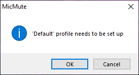
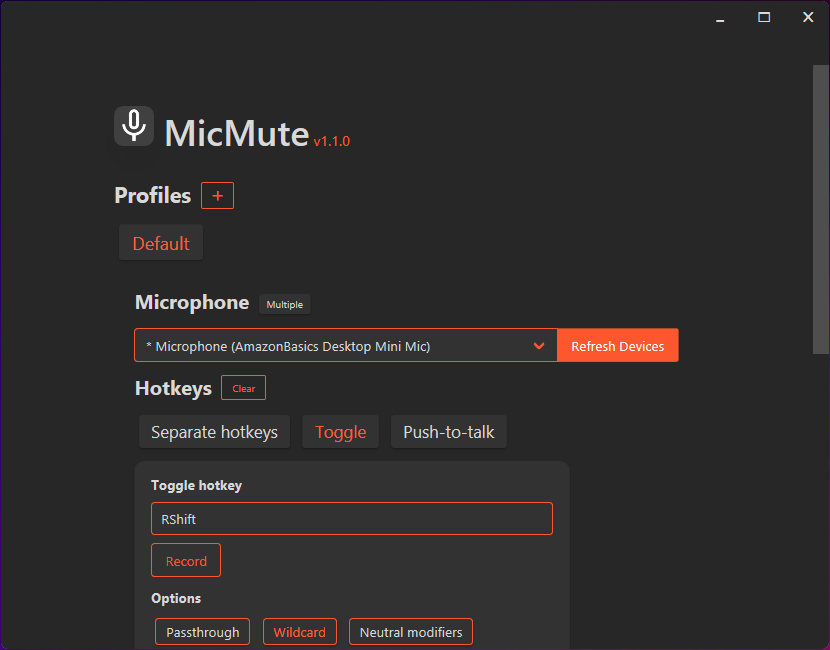

<h1 align="center">
    </img>
    MicMute
</h1>
<p align="center">
    Control your microphone using keyboard shortcuts.
</p>
<p align="center">
    <a href="https://github.com/SaifAqqad/AHK_MicMute/actions?query=workflow%3Acompile_prerelease"></img></a>
    <a href="https://github.com/SaifAqqad/AHK_MicMute/releases/latest"></a>
    <a href="https://github.com/SaifAqqad/AHK_MicMute/releases/latest"></img></a>
    <a href="https://www.autohotkey.com/docs/AHKL_ChangeLog.htm#v1.1.33.02"></img></a>
</p>

## Features

   * Set up multiple profiles and link them to apps/games
   * Use separate hotkeys for Mute/Unmute or a single toggle/push-to-talk hotkey
   * Optional sound and on-screen feedback
   * AFK timeout (auto mute when the user is AFK for longer than a specified time interval)
   * Auto-start on boot
   * Very lightweight ( File size ≈ 1MB, CPU usage ≤ 1%, Memory usage ≤ 20MB )
## Install using [Scoop](https://scoop.sh)

   ```powershell
      # Add the extras bucket
      scoop bucket add extras
      # Install MicMute
      scoop install micmute
   ```
   ###### You can update MicMute using `scoop update micmute`, your config file will be saved between updates.

## Use standalone executable
   You can [download MicMute](https://github.com/SaifAqqad/AHK_MicMute/releases/latest/download/MicMute.exe) and use it standalone.

## Usage

On the first run, you'll be asked to set up a profile:



Click OK and a new configuration window will open:




1. Choose your microphone from the drop down list.

2. Choose whether you want separate hotkeys for Mute and Unmute or a single Toggle/Push-to-talk hotkey.

      


3. Based on your choice, you will either need to setup both hotkeys or just one of them.
        
   - Click on 'Record' then press the key(s) you want.
   - Turn on 'Wildcard' if you want the hotkey to be fired even if extra modifiers/keys are held down.
   - Turn on 'Passthrough' if you don't want the key's native function to be blocked/hidden from the system.
   - Turn off "Neutral modifiers" if you want to specify which key of the modifier pair to use (i.e. `Left Alt` or `Right Alt` instead of `Alt`) .
      
      ##### Using a neutral modifier (i.e. Alt) alone as a hotkey will turn on passthrough
   
4. Choose whether you want sound feedback when muting/unmuting the microphone or on-screen feedback or both.


   <details><summary>On screen feedback</summary>
   
   
   
   </details>

5. Choose whether you want the OSD to exclude fullscreen apps/games (this is needed for games that lose focus when the OSD is shown).

7. Set up "AFK Timeout" if you want the microphone to be muted when you idle for longer than a set interval (in minutes).

8. Click on "Select app" and choose an app's executable if you want to link the profile to that app (switch to the profile when the app is launched and switch back to default when it is closed)

9. Click "Save profile"

<details><summary><b>You can change the profile's name by right clicking the profile tag</b></summary> 


</details>

#### Some options are not available in the GUI but can be changed in the [config file](#editing-the-config-file)
* Mute on startup
* Use custom sounds
## Editing the config file
 Hold shift when asked to setup a profile or when clicking "Edit configuration" from the tray menu, and the config file will open in a text editor


```json
{
    "DefaultProfile": "Default",
    "MuteOnStartup": 0,
    "Profiles": [
        {
            "afkTimeout": 2,
            "ExcludeFullscreen": 1,
            "LinkedApp": "",
            "Microphone": "Microphone (AmazonBasics Desktop Mini Mic)",
            "MuteHotkey": "*RShift",
            "OnscreenFeedback": 1,
            "OSDPos": {
                "x": "96",
                "y": "998"
            },
            "ProfileName": "Default",
            "PushToTalk": 0,
            "SoundFeedback": 1,
            "UnmuteHotkey": "*RShift",
            "UpdateWithSystem": 1
        }
    ],
    "UseCustomSounds": 0
}
```
### Custom sounds
To use custom sounds, set `UseCustomSounds` to `1` then put the sound files (`mp3`,`wav`...) in the same directory as `MicMute.exe` and rename them as:

**Mute sound**: `mute` 

**Unmute sound**: `unmute` 

**PTT on**: `ptt_on` 

**PTT off**: `ptt_off`

## Compile instructions
##### Run these commands in powershell
1. Clone the repository
    ```powershell
    git clone https://github.com/SaifAqqad/AHK_MicMute.git;
    cd .\AHK_MicMute\;
    ```
2. Install autohotkey
    ```powershell
    scoop bucket add extras;
    scoop install autohotkey;
    ```
3. Install upx (optional)
    ```powershell
    scoop install upx;
    cp "$(scoop prefix upx)\upx.exe" -Destination "$(scoop prefix autohotkey)\Compiler\";
    ```
4. Run ahk2exe
    ```powershell
    ahk2exe /in ".\src\MicMute.ahk" /out ".\src\MicMute.exe";    # add `/compress 2` if upx was installed
    ```

## Known issues
* When running MicMute alongside [Microsoft powertoys](https://github.com/microsoft/PowerToys), powertoys might conflict with MicMute and the hotkeys will stop working. [microsoft/PowerToys#2132](https://github.com/microsoft/PowerToys/issues/2132)

## Libraries and resources used

   * [VA.ahk](https://autohotkey.com/board/topic/21984-vista-audio-control-functions/) ([public domain](https://autohotkey.com/board/topic/36032-lexikos-default-copyright-license/))
   * [Neutron.ahk](https://github.com/G33kDude/Neutron.ahk) ([MIT License](https://github.com/G33kDude/Neutron.ahk/blob/master/LICENSE))
   * [Bulma CSS framework](https://bulma.io/) ([MIT License](https://github.com/jgthms/bulma/blob/master/LICENSE))
   * [Material Design icons](https://github.com/Templarian/MaterialDesign) ([Apache 2.0](https://github.com/Templarian/MaterialDesign/blob/master/LICENSE))
