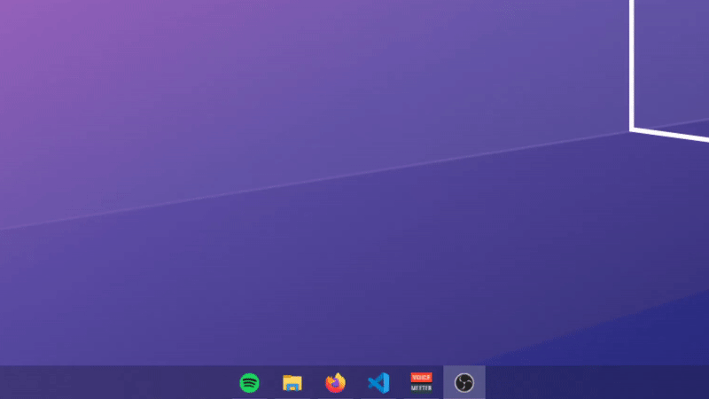

<h1 align="center">
 </img> 
MicMute
</h1>
<p align="center">
  Control your microphone using keyboard shortcuts.
</p>

## Features

   * Separate hotkeys for Mute/Unmute 
   * Single toggle/push-to-talk hotkey
   * Optional sound and on-screen feedback
   * AFK timeout (auto mute when the user is AFK for longer than a specified time interval)
   * Auto-start on boot

## Install using [Scoop](https://scoop.sh) (Recommended)

1. Install scoop using powershell
    
        Set-ExecutionPolicy RemoteSigned -scope CurrentUser
        iwr -useb get.scoop.sh | iex
2. Add my bucket to scoop
        
        scoop install git
        scoop bucket add utils https://github.com/SaifAqqad/utils.git
3. Install MicMute

        scoop install micmute
   ##### Scoop will allow you to update easily using `scoop update micmute`, and will save your config file between updates.

## Install using the updater script
   Download the [updater](https://github.com/SaifAqqad/AHK_MicMute/releases/latest/download/updater.exe) and run it.
   ##### The updater might falsely trigger windows defender as any portable unsigned executable does

## Usage

On the first run, you will be asked to set up MicMute:


Click OK and a new configuration window will open:


1. Choose your microphone from the drop down list.

2. Choose whether you want separate hotkeys for Mute and Unmute or a single Toggle/Push-to-talk hotkey.

3. Based on your choice, you will either need to setup both hotkeys or just one of them.
        
   - Click on 'Record' then press the key(s) you want.
   - Turn on 'Wildcard' if you want the hotkey to be fired even if extra modifiers/keys are held down.
   - Turn on 'Passthrough' if you don't want the key's native function to be blocked/hidden from the system.
   - Turn off "Neutral modifiers" if you want to specify which key of the modifier pair to use (i.e. `Left Alt` or `Right Alt` instead of `Alt`) .
   
4. Choose whether you want sound feedback when muting/unmuting the microphone or on-screen feedback or both.

      


   <details><summary>On screen feedback</summary>
   
   
   
   
   </details>

5. Choose whether you want the OSD to exclude fullscreen apps/games (this is needed for games that lose focus when the OSD is shown).

6. Set up "AFK Timeout" if you want it to automatically mute the microphone when you idle for longer than a set interval (in minutes).

7. Click "Save Config"


<details><summary><b>You can also write/edit the config file in a text editor:</b></summary> 

###### config.ini

```ini
[settings]
Microphone=""
MuteHotkey=""
UnmuteHotkey=""
PushToTalk=
SoundFeedback=
OnscreenFeedback=
ExcludeFullscreen=
UpdateWithSystem=
afkTimeout=
```

1. `Microphone` can be any substring of your microphone's name or the controller's name as shown in this image:
   <details><summary>image</summary>

   

   </details>
   
   you can also leave it as `""` to select the default microphone
### 
2. Both `MuteHotkey` and `UnmuteHotkey` can be any hotkey supported by AHK, use this [List of keys](https://www.autohotkey.com/docs/KeyList.htm) as a reference, you can also combine them with [hotkey modifiers](https://www.autohotkey.com/docs/Hotkeys.htm#Symbols).

   You can set both to the same hotkey to make it a toggle.


   Examples: `"<^M"`: left ctrl+M, `"RShift"`: right shift, `"^!T"`: ctrl+alt+T, `"LControl & XButton1"`: left ctrl+ mouse 4


3. Set `PushToTalk` to `1` to enable PTT,  `MuteHotkey` and `UnmuteHotkey` need to be set to the same hotkey first.

4. Both `SoundFeedback` and `OnscreenFeedback` can be set to either `0` or `1`, you can also set `ExcludeFullscreen` to 1 to stop the OSD from showing on top of fullscreen applications
   <details><summary>On screen feedback</summary>

   

   </details>
   
5. If `UpdateWithSystem` is set to 1, the tray icon will update whenever the microphone is muted/unmuted by the OS or other applications, it increases CPU usage by 1% at most

   
### 
<details><summary>Example of a correct config</summary>

```ini
[settings]
Microphone="amazonbasics"
MuteHotkey="*RShift"
UnmuteHotkey="*RShift"
PushToTalk=0
SoundFeedback=1
OnscreenFeedback=1
ExcludeFullscreen=0
UpdateWithSystem=1
afkTimeout=5
```           

</details>

</details>

## Libraries and resources used:

   * [VA.ahk](https://autohotkey.com/board/topic/21984-vista-audio-control-functions/)
   * [Neutron.ahk](https://github.com/G33kDude/Neutron.ahk)
   * [OSD.ahk](https://github.com/SaifAqqad/AHK_Script/blob/master/src/Lib/OSD.ahk)
   * [Bulma CSS framework](https://bulma.io/)
   * [Material Design icons](https://github.com/Templarian/MaterialDesign)
