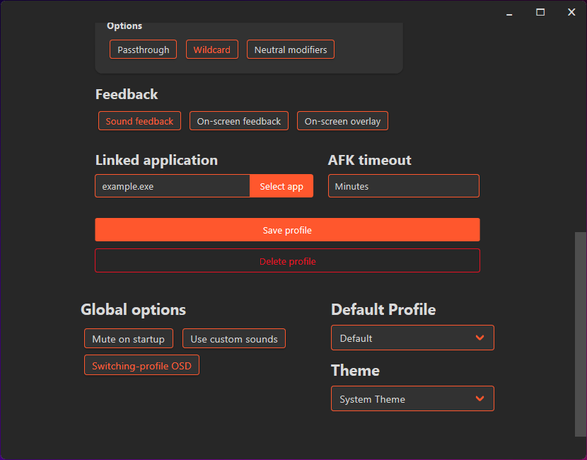

<h1 align="center">
    </img>
    MicMute
</h1>
<p align="center">
    Control your microphone using keyboard shortcuts.
</p>
<p align="center">
    <a href="https://github.com/SaifAqqad/AHK_MicMute/releases/latest">
        
    </a>
    <a href="https://github.com/SaifAqqad/AHK_MicMute/releases/latest">
        </img>
    </a>
    <a href="https://www.autohotkey.com/docs/AHKL_ChangeLog.htm">
        </img>
    </a>
</p>

## Features

   * Set up multiple profiles and link them to apps/games
   * Use separate hotkeys for Mute/Unmute or a single toggle/push-to-talk hotkey
   * Optional sound and on-screen feedback
   * AFK timeout (auto mute when the user is AFK for longer than a specified time interval)
   * Auto-start on boot

## Install using [Scoop](https://scoop.sh)

   ```powershell
      # Run this in powershell, it will install scoop, add my bucket and then install MicMute 
      Set-ExecutionPolicy RemoteSigned -scope CurrentUser;iwr -useb get.scoop.sh | iex;scoop install git;scoop bucket add utils https://github.com/SaifAqqad/utils.git;scoop install micmute;
   ```
   ###### You can update MicMute using `scoop update micmute`, your config file will be saved between updates.

## Install using the updater script
   Download the [updater](https://github.com/SaifAqqad/AHK_MicMute/releases/latest/download/updater.exe) and run it.
  ###### The updater might falsely trigger windows defender as any portable unsigned executable does.
## Usage

On the first run, you'll be asked to set up a profile:


Click OK and a new configuration window will open:


1. Enter a profile name

2. Choose your microphone from the drop down list.

3. Choose whether you want separate hotkeys for Mute and Unmute or a single Toggle/Push-to-talk hotkey.

      


4. Based on your choice, you will either need to setup both hotkeys or just one of them.
        
   - Click on 'Record' then press the key(s) you want.
   - Turn on 'Wildcard' if you want the hotkey to be fired even if extra modifiers/keys are held down.
   - Turn on 'Passthrough' if you don't want the key's native function to be blocked/hidden from the system.
   - Turn off "Neutral modifiers" if you want to specify which key of the modifier pair to use (i.e. `Left Alt` or `Right Alt` instead of `Alt`) .
      
      ##### Using a neutral modifier (i.e. Alt) alone as a hotkey will turn on passthrough
   
5. Choose whether you want sound feedback when muting/unmuting the microphone or on-screen feedback or both.


   <details><summary>On screen feedback</summary>
   
   
   
   
   </details>

6. Choose whether you want the OSD to exclude fullscreen apps/games (this is needed for games that lose focus when the OSD is shown).

7. Set up "AFK Timeout" if you want the microphone to be muted when you idle for longer than a set interval (in minutes).

8. Click on "Select app" and choose an app's executable if you want to link the profile to that app (switch to the profile when the app is launched and switch back to default when it is closed)

9. Click "Save profile"


<details><summary><b>You can also write/edit the config file in a text editor:</b></summary> 

## Editing the config file
 Hold shift when asked to setup a profile or when clicking "Edit configuration" from the tray menu, and the config file will open in a text editor


```json
{
    "DefaultProfile": "Default",
    "Profiles": [
        {
            "afkTimeout": "2",
            "ExcludeFullscreen": 1,
            "LinkedApp": "",
            "Microphone": "Microphone (AmazonBasics Desktop Mini Mic)",
            "MuteHotkey": "*RShift",
            "OnscreenFeedback": 1,
            "ProfileName": "Default",
            "PushToTalk": 0,
            "SoundFeedback": 1,
            "UnmuteHotkey": "*RShift",
            "UpdateWithSystem": 1
        }
    ]
}
```

1. `Microphone` can be any substring of your microphone's name or the controller's name as shown in this image:
   <details><summary>image</summary>

   

   </details>
   
   you can also leave it as `"capture"` to select the default microphone
### 
2. Both `MuteHotkey` and `UnmuteHotkey` can be any hotkey supported by AHK, use this [List of keys](https://www.autohotkey.com/docs/KeyList.htm) as a reference, you can also combine them with [hotkey modifiers](https://www.autohotkey.com/docs/Hotkeys.htm#Symbols).

   You can set both to the same hotkey to make it a toggle.


   Examples: `"<^M"`: left ctrl+M, `"RShift"`: right shift, `"^!T"`: ctrl+alt+T, `"LControl & XButton1"`: left ctrl+ mouse 4


3. Set `PushToTalk` to `1` to enable PTT,  `MuteHotkey` and `UnmuteHotkey` need to be set to the same hotkey first.

4. Both `SoundFeedback` and `OnscreenFeedback` can be set to either `0` or `1`, you can also set `ExcludeFullscreen` to 1 to stop the OSD from showing on top of fullscreen applications
   <details><summary>On screen feedback</summary>

   

   </details>
   
5. If `UpdateWithSystem` is set to 1, the tray icon will update whenever the microphone is muted/unmuted by the OS or other applications.

</details>

## Libraries and resources used:

   * [VA.ahk](https://autohotkey.com/board/topic/21984-vista-audio-control-functions/)
   * [Neutron.ahk](https://github.com/G33kDude/Neutron.ahk)
   * [OSD.ahk](https://github.com/SaifAqqad/AHK_Script/blob/master/src/Lib/OSD.ahk)
   * [Bulma CSS framework](https://bulma.io/)
   * [Material Design icons](https://github.com/Templarian/MaterialDesign)
