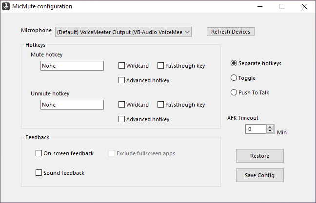

<h1 align="center">
 </img> 
MicMute
</h1>
<p align="center">
  Control your microphone using keyboard/mouse shortcuts.
</p>

## Features

   * Seperate hotkeys for Mute/Unmute 
   * Single toggle/push-to-talk hotkey
   * Hotkeys can be (optionally) set up using AHK's syntax
   * Optional sound and on-screen feedback
   * AFK timeout (auto mute when the user is AFK for longer than a set interval)
   * Auto-start on boot

## Install using [Scoop](https://scoop.sh)

1. Install scoop using powershell
    
        iwr -useb get.scoop.sh | iex
2. Add my bucket to scoop
        
        scoop install git
        scoop bucket add utils https://github.com/SaifAqqad/utils.git
3. Install MicMute

        scoop install micmute

#### If you Install the application using scoop, it will run at startup. You can disable this from task manager.

## Usage

The first time you run the script, you will be asked to setup the hotkeys:


Click OK and a new configuration window will open:



1. Choose your microphone from the drop down list.

2. Choose whether you want Seprate hotkeys for Mute and Unmute or Toggle/Push To Talk.

3. Based on your choice, you will either need to setup both hotkeys or just one of them.
        
   - Click on the empty box for the hotkey then choose the key(s) you want.
   - Check the "Wildcard" box if you want to fire the hotkey even if extra modifiers are being held down.
   - Check the "Passthrough key" box if you don't want the key's native function to be blocked (hidden from the system).
   - Check the "Advanced hotkey" box if you want to enter an AHK hotkey string instead (see [AHK docs](https://www.autohotkey.com/docs/KeyList.htm) for more info).
   
4. Choose whether you want the script to give sound feedback when muting/unmuting the microphone or on-screen feedback in the form of an OSD or both.

   <details><summary>On screen feedback</summary>
   
   
   
   </details>

5. Choose whether you want the OSD to exclude fullscreen apps/games (this is needed if the fullscreen app/game loses focus when the OSD is shown)

6. Click "Save Config"

<details><summary><b>You can also write/edit the config file in a text editor:</b></summary> 

###### config.ini

```ini
[settings]
Microphone=""
MuteHotkey=""
UnmuteHotkey=""
PushToTalk=
SoundFeedback=
OnscreenFeedback=
ExcludeFullscreen=
UpdateWithSystem=
```

1. `Microphone` can be any substring of your microphone's name or the controller's name as shown in this image:
   <details><summary>image</summary>

   

   </details>
   
   you can also leave it as `""` to select the default microphone
### 
2. Both `MuteHotkey` and `UnmuteHotkey` can be any hotkey supported by AHK, use this [List of keys](https://www.autohotkey.com/docs/KeyList.htm) as a reference, you can also combine them with [hotkey modifiers](https://www.autohotkey.com/docs/Hotkeys.htm#Symbols).

   You can set both to the same hotkey to make it a toggle.


   Examples: `"<^M"`: left ctrl+M, `"RShift"`: right shift, `"^!T"`: ctrl+alt+T, `"LControl & XButton1"`: left ctrl+ mouse 4


3. Set `PushToTalk` to `1` to enable PTT,  `MuteHotkey` and `UnmuteHotkey` need to be set to the same hotkey first.

4. Both `SoundFeedback` and `OnscreenFeedback` can be set to either `0` or `1`, you can also set `ExcludeFullscreen` to 1 to stop the OSD from showing on top of fullscreen applications
   <details><summary>On screen feedback</summary>

   

   </details>
   
5. If `UpdateWithSystem` is set to 1, the tray icon will update whenever the microphone is muted/unmuted by the OS or other applications, it increases CPU usage by 1% at most

   
### 
<details><summary>Example of a correct config</summary>

```ini
[settings]
Microphone="amazonbasics"
MuteHotkey="*RShift"
UnmuteHotkey="*RShift"
PushToTalk=0
SoundFeedback=1
OnscreenFeedback=1
ExcludeFullscreen=0
UpdateWithSystem=1
```           

</details>

</details>
